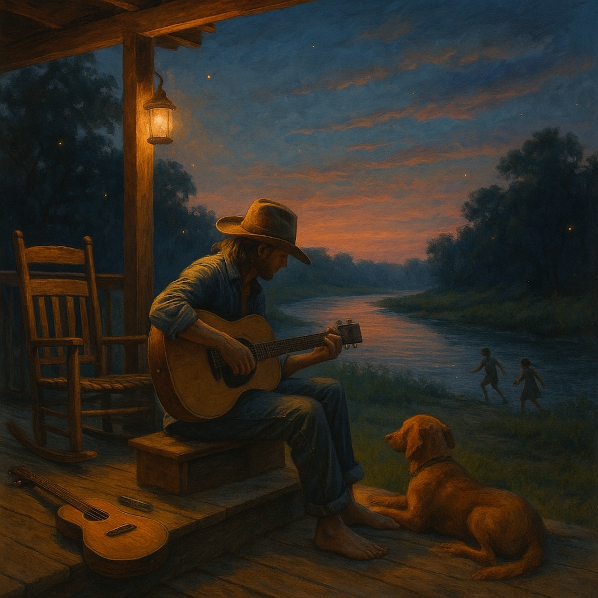

# Walk On Easy  
  
*Walk On Easy* is a warm, blues-folk song about traveling light in a world that’s all connected. Inspired by the Lotus Sūtra’s teaching of peaceful conduct, it tells a simple story: no gate to guard, no crown to wear—just one wide river of life where everyone belongs. With finger-picked guitar, gentle harmonica, and a slow front-porch groove, this tune invites listeners of all ages to let go of heavy labels, trust the flow, and walk free.  
  
**Search Tags**  
blues , folk , acoustic , front-porch , slow shuffle , calm , peaceful , Lotus Sutra , inspired , spiritual , non-dual , easy listening , acoustic guitar , harmonica , relaxing , reflective , one river , walk on easy , americana   
  
Lyrics:   
[Verse 1]  
No gate to guard, no heavy crown,  
just a road that rolls on down.  
Names and labels fade away,  
like chalk in the rain at the end of the day.  
  
[Chorus]  
Walk on easy, light and free,  
nothing to prove, just let it be.  
The world’s one river, wide and deep,  
moves and sings while we all keep beat.  
  
[Verse 2]  
No road higher, no road low,  
just one path where all can go.  
Pride’s a kite that’s lost its string,  
truth don’t need a fancy wing.  
  
[Chorus]  
Walk on easy, light and free,  
nothing to prove, just let it be.  
The world’s one river, wide and deep,  
moves and sings while we all keep beat.  
  
[Verse 3]  
Not all real, not all pretend,  
beginnings meet where endings bend.  
No man, no woman set apart,  
we’re all bright sparks of the same big heart.  
  
[Bridge – Harmonica or Slide Guitar]  
(Soft, hopeful notes like a friend’s kind call.)  
  
[Verse 4]  
Don’t grab tight, don’t need to know,  
let the gentle mystery flow.  
Kindness grows where fear won’t stay,  
love lights up the wandering way.  
  
[Final Chorus – Repeat & Fade]  
Walk on easy, light and free,  
nothing to prove, just let it be.  
The world’s one river, wide and deep,  
moves and sings while we all keep beat.  
  
  
