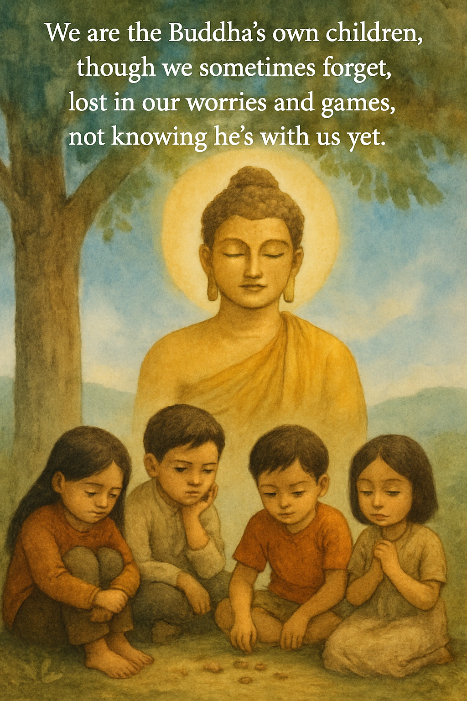
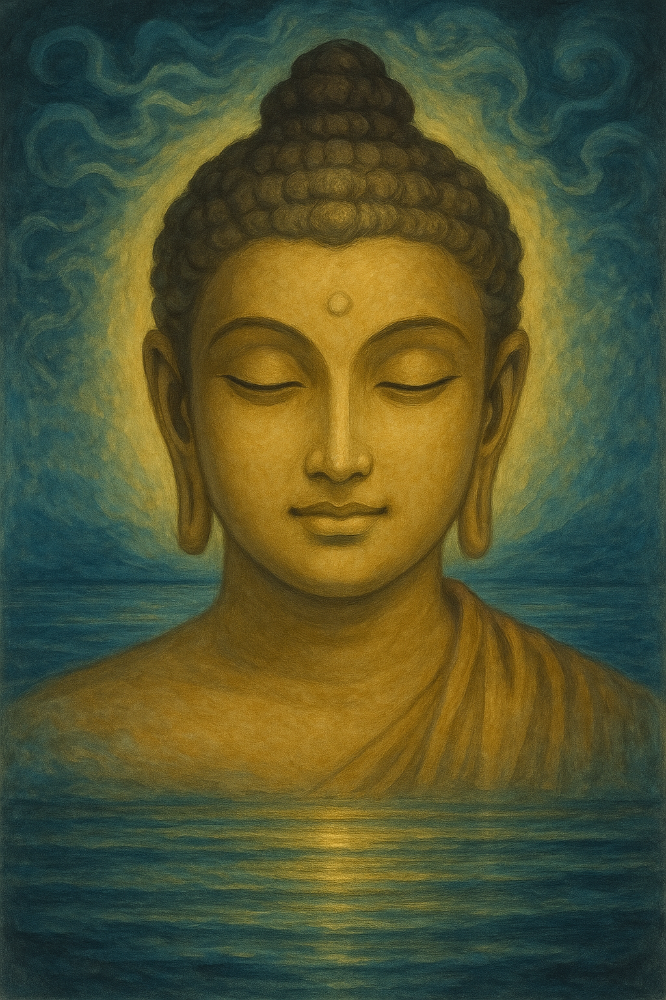
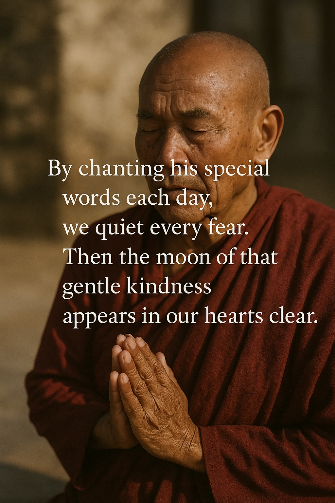

# When Our Hearts Grow Quite  
  
We are the Buddha’s own children,  
though we sometimes forget,  
lost in our worries and games,  
not knowing he’s with us yet.  
  
When our minds are busy like wind,  
we cannot see his face.  
But if we calm our thoughts like still water,  
his love shines in that place.  
  
By chanting his special words each day,  
we quiet every fear.  
Then the moon of that gentle kindness  
appears in our hearts clear.  
  
So let’s remember we’re never alone,  
and give thanks in all we do.  
When our minds are peaceful and grateful,  
the Buddha’s light shines through.  
  
  
  
