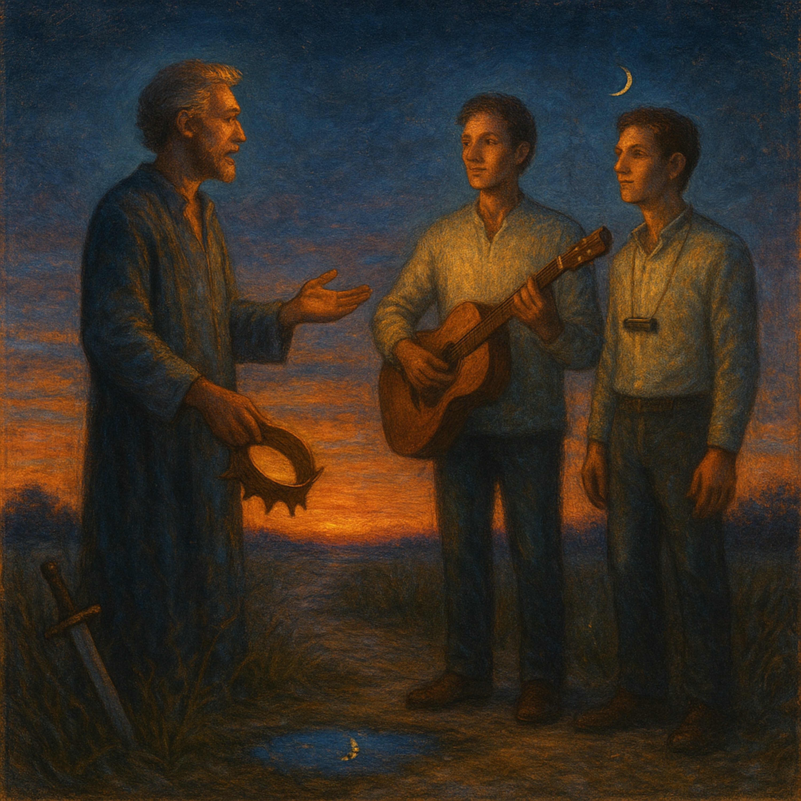

# Wonder Beneath the Moon  
  
*Wonder Beneath the Moon* is a bluesy folk retelling of the Lotus Sūtra’s King Wonderful-Adornment story.  
With just guitar and harmonica, it paints the moment when a powerful father lays down his crown after hearing his two sons’ quiet truth. No miracles, no fireworks—only the slow, soul-deep power of love and insight. The song celebrates transformation that comes from within: turning an old life into a new story, letting wisdom wash away anger, and finding a peaceful kingdom hidden in the heart.  
  
**Search Tags**  
blues folk,acoustic guitar,harmonica,singer songwriter,story song,lotus sutra inspired,spiritual blues,folk blues,inner transformation,quiet power,acoustic ballad,modern parable,heart awakening,peaceful kingdom,new story told  
  
Verse 1  
A father wore a kingdom like a stone-cold crown,  
Counting battles and borders, weighing every town.  
But his two young sons walked a quieter mile,  
Found a well of mercy, found a reason to smile.  
  
Chorus  
They sang him a blues, a slow, truth-telling tune,  
Showed him a wonder beneath the hot-afternoon moon.  
No water to wine, no stone into gold—  
Just a heart re-written and a new story told.  
  
Verse 2  
He caught his own reflection in their fearless eyes,  
Saw a power unchained from force or lies.  
Watched anger fall like a summer rain,  
Felt the clean stream wash his pain.  
Laid down the iron, let the silence in,  
Found a peaceful kingdom deep under his skin.  
  
Chorus  
They sang him a blues, a slow, truth-telling tune,  
Showed him a wonder beneath the hot-afternoon moon.  
No water to wine, no stone into gold—  
Just a heart re-written and a new story told.  
  
Bridge  
Some chase lightning, some chase flame,  
Think a show of magic will change the game.  
But the strongest spell you’ll ever cast  
Is the love you open and the fear you outlast.  
  
Chorus (repeat)  
They sang him a blues, a slow, truth-telling tune,  
Showed him a wonder beneath the hot-afternoon moon.  
No water to wine, no stone into gold—  
Just a heart re-written and a new story told.  
  
Outro  
He set down his crown, he laid down his sword,  
Walked home lighter with every word.  
Every word, yeah—every word.  
  
  
