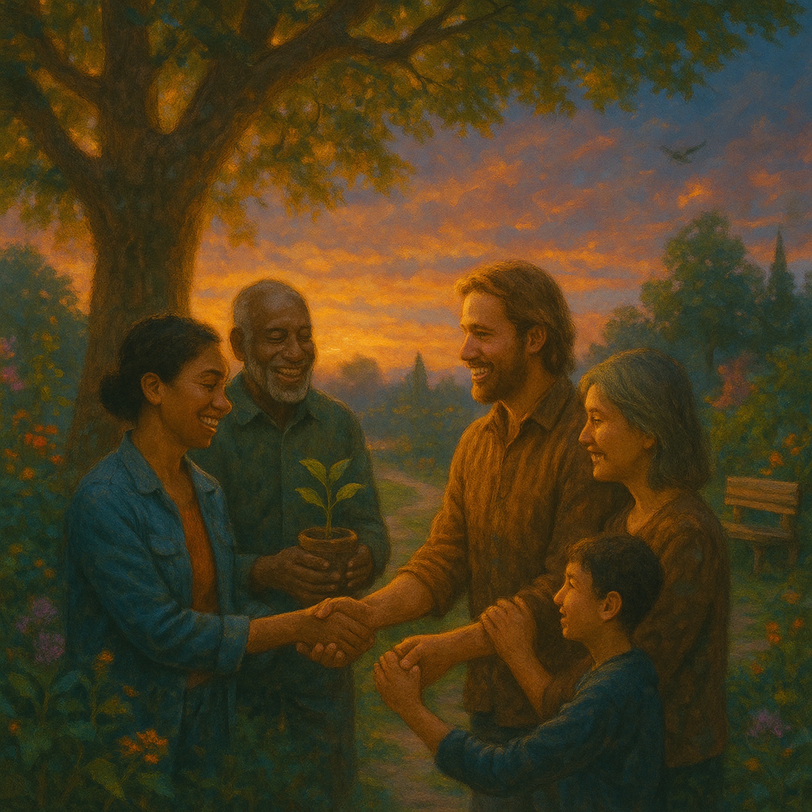

## “My Compassionate Friend  
(A hopeful, slightly gospel-tinged folk song about embracing collective potential and a mission for the greater good, recognizing innate worth and its compassionate purpose.)  
  
(Verse 1)   
Thought I'd reached the ending, walked out of inner strife,   
Left the flames behind me, for a peaceful, quiet life.   
Found a calm reward for toil, a day's pay for my soul,   
Didn't know the whole wide garden was waiting to be whole.   
My own path of freedom, it purified my heart,   
But it was just a staging post, where a new journey starts.  
  
(Chorus)   
Oh, the world's got a grand design, and I'm part of it, it's true,   
Not just for myself, but for me and for you.   
It's the shared human journey, from the beginning to the end,   
To open wisdom's door for all, as a compassionate friend.  
  
(Verse 2)   
An old elder, full of patience, with a skillful, gentle hand,   
Helped me clear the old assumptions, across this weary land.   
Not just sorrow, greed, and anger, not just misery and pain,   
But the biggest lie of all—that I couldn't rise again.   
My own limited view, a barrier in my mind,   
Believing I was less, leaving my full self behind.  
  
(Chorus)   
Oh, the world's got a grand design, and I'm part of it,   
it's true, Not just for myself, but for me and for you.   
It's the shared human journey, from the beginning to the end,   
To open wisdom's door for all, as a compassionate friend.  
  
(Verse 3)   
The lie that said I wasn't worthy of a wisdom deep and vast,   
That personal peace was the ending, with all my potential past.   
But a greater vision, a legacy, was always my own,   
An inherent light was shining, deep within my bones.   
This inborn capability, a birthright grand and free,   
Waiting for my awakening, for the whole wide world to see.  
  
(Chorus)   
Oh, the world's got a grand design, and I'm part of it,   
it's true, Not just for myself, but for me and for you.   
It's the shared human journey, from the beginning to the end,   
To open wisdom's door for all, as a compassionate friend.  
  
(Bridge)   
From individual freedom, to a mission for all mankind,   
To see this broken world as a pure land, and leave no one behind.   
It's a long, patient practice, not a magic, sudden spark,   
But the potential's always waiting, even in the dark.   
The shedding of illusion, a letting go of all separation,   
To embrace my place in the universal family, with joyful affirmation.  
  
(Outro)   
Yeah, the common good's call, calling me to serve,   
With courage and contribution, my true human nerve.   
The world's potential is right here where we stand,   
That vast, immeasurable potential, it's in your heart, my friend.  
  
folk , gospel-tinged , hopeful , compassionate friend , collective potential , shared human journey , spiritual awakening , inner peace , community , greater good , self-discovery , universal family , pure land , courage , contribution , inspirational , acoustic , uplifting , human connection , unity , transformative , wisdom , birthright potential , service , patience , light within  
  
  
