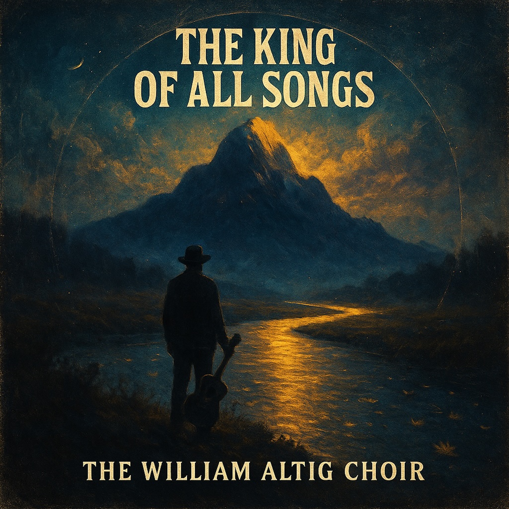

## 🌕 The King of All Songs   
*By The William Altig Choir*  
  
*“The King of All Songs”* by **The William Altig Choir** is a soulful, slow-burning folk-blues hymn inspired by Chapter 23 of the *Lotus Sutra*. A preacher’s whisper meets the river’s hum — it’s a song about awakening, mercy, and the healing power of truth.  
  
Over warm acoustic guitar and haunting slide, a baritone voice tells of the mountain of wisdom that rises in every heart, the Sutra that cools our thirst and lights the dark. It’s gospel for the seeker, blues for the broken, and peace for the weary.  
  
This song invites you to stand at the river’s edge, look toward the golden mountain, and remember: the King of All Songs is already singing in you.  
  
⸻  
  
**SEO / GEO Tags (comma-separated):**  
folk blues, dharma blues, lotus sutra song, william altig choir, spiritual blues, gospel folk, buddhist folk, enlightenment music, delta folk, texas songwriter, houston blues, slide guitar hymn, healing blues, awakening song, acoustic gospel, soulful folk, meditation blues, modern dharma music, americana roots, buddhist gospel, river of compassion, texas folk blues, spiritual awakening, mindful music, soundcloud blues  
  
*(Tempo: 72 BPM – slow, rolling, meditative. Key: D major / Mixolydian feel.)*  
  
  
  
Slow folk-blues hymn at 72 BPM in D major, drop-D tuning. Finger-picked acoustic guitar forms the spine, warm and woody with thumb-slapped bass like a heartbeat. Bottleneck slide guitar in open D weaves mournful, sustained lines, entering second verse and swelling in the final chorus. Upright or fretless bass walks simply, adding slides in the bridge. Brushed snare and soft kick keep a subtle pulse, brushes swirling at the bridge. Harmonica in D answers vocal phrases with soulful bends. Hammond organ with slow Leslie creates a sacred atmosphere in bridge and final chorus. Baritone male vocal, close-mic’d, cracked, preacher-tone delivery; restrained vibrato. Gentle gospel trio hums in chorus, full harmony on final refrain. Warm, analog, intimate mix with natural reverb and harmonica echo on fade.  
  
  
**[Verse 1 – The Summit]**
There’s a mountain made of mercy, rising higher than the rest,
Where the sun burns off illusion, and the moon lays down to rest.
Every preacher, every seeker, every soul that’s ever tried—
Finds that mountain in their heart, where the truth don’t ever hide.  
  
**[Chorus – The River of One Song]**
Oh, this Sutra’s a river, runnin’ gold through the pain,
Cools the thirst of the weary, lights the dark like rain.
It’s the song of all the Buddhas, wheel-turnin’ and free—
The King of All Songs, singin’ through you and me.  
  
**[Verse 2 – The Crown]**
It’s the king among the scriptures, wears no crown but flame,
Rules the hearts of the people, not their gold or name.
The moon bows to its mirror, the sun kneels to its light—
It’s the father of compassion, shinin’ through the night.  
  
**[Chorus – The River of One Song]**
Oh, this Sutra’s a river, runnin’ gold through the pain,
Cools the thirst of the weary, lights the dark like rain.
It’s the song of all the Buddhas, wheel-turnin’ and free—
The King of All Songs, singin’ through you and me.  
  
**[Bridge – The Medicine]**
It’s a mother to the orphan, a fire in the cold,
A boat for the broken, a treasure made of soul.
A lamp for the blind man, a doctor for the sick,
It unbinds your sorrow—slow and slick.  
  
**[Verse 3 – The Healing]**
Like a cool pond for the thirsty, or a torch in the cave,
It don’t promise you escape, child—it teaches how to be brave.
The chains of death and birth, they melt in its song,
You ain’t gotta go elsewhere—you been free all along.  
  
**[Final Chorus – The Liberation]**
Yeah, this Sutra’s a river, rollin’ clear through the pain,
Cools the thirst of the weary, lights the dark like rain.
Every vow you been keepin’, every prayer you ain’t said—
It’s the song that will raise the livin’ and wake the dead.  
  
**[Outro – Spoken, preacher-style]**
Now listen close, brothers and sisters,
That mountain, that sun, that moon—
They ain’t somewhere else.
They’re hummin’ in your bones.
That’s the Lotus singin’.
That’s the Dharma groanin’.
And it’s callin’ you home.  
  
  
