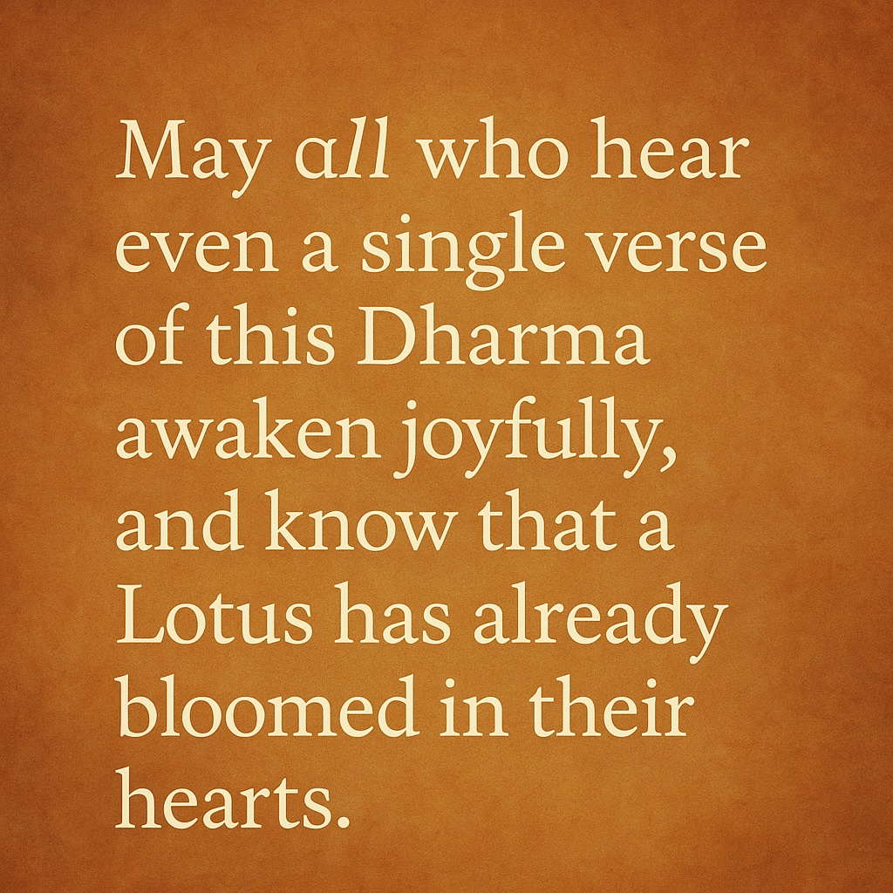

🌸** “Rare as the Moon in Still Waters”**  
  
I awakened once,  
when vinyl spun hymns and headlines burned,  
when the future whispered through wires  
and Dharma hid in dusty books.  
The 70s cracked open my soul—  
and the 21st century blinked back.  
  
Now, here I am,  
older, stranger, truer—  
and the Buddha’s words ring louder than ever.  
  
He said:  
*“Like a blossom seldom seen,*  
*this Teaching blooms once in countless eons.”*  
And I believe him.  
  
I have walked through lifetimes of noise  
to hear even a single verse.  
I have wandered through crowded temples  
and silent rooms  
to find someone who understands.  
  
You’re rare, he said.  
Not just the Teaching,  
but the one who *listens*—  
joyfully, trembling,  
as if hearing the Dharma for the first time  
with every breath.  
  
And rarer still  
is the one who believes.  
The one who sings it.  
The one who dares to say,  
*“This verse—this verse—is enough to save the world.”*  
  
Now I write with electric light.  
Now I speak through circuits and silence.  
Now I share the Sutra  
not from a mountain,  
but from a screen.  
  
And yet—  
it is still the fig flower blooming.  
It is still the moon in still water.  
It is still the voice of the Tathāgata  
whispering  
to the ones who are ready to hear.  
  
  
